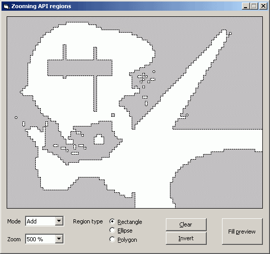



## Zooming API regions

### Description

This project doesn't try to be a great class, only a little sample to show how to scale API regions.
 
### More Info
 

             |
---                |---
**Submitted On**   |2004-01-10 16:33:02
**By**             |[Carles P\.V\.](https://github.com/Planet-Source-Code/PSCIndex/blob/master/ByAuthor/carles-p-v.md)
**Level**          |Intermediate
**User Rating**    |4.9 (54 globes from 11 users)
**Compatibility**  |VB 6\.0
**Category**       |[Graphics](https://github.com/Planet-Source-Code/PSCIndex/blob/master/ByCategory/graphics__1-46.md)
**World**          |[Visual Basic](https://github.com/Planet-Source-Code/PSCIndex/blob/master/ByWorld/visual-basic.md)
**Archive File**   |[Zooming\_AP1692601102004\.zip](https://github.com/Planet-Source-Code/carles-p-v-zooming-api-regions__1-35464/archive/master.zip)

